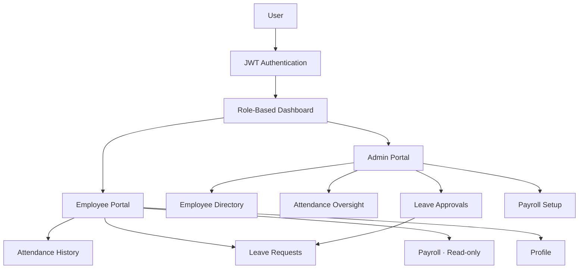

### Dayflow - HRMS

Dayflow is a modern, responsive, and production-grade Human Resource Management System (HRMS) built for the **Odoo x NMIT Bangalore Hackathon 2026**.

It features a split-role architecture separating standard Employees from HR Administrators, providing a seamless workflow for tracking attendance, managing leave requests, and handling payroll structures.

## Features
 
### Employee Portal
 
* **Dashboard** — quick overview of attendance metrics, live check-in/out, and pending leaves
* **Attendance History** — detailed log of all daily check-ins and check-outs
* **Leave Management** — submit new leave requests (Sick, Paid, Unpaid) and track approval status
* **Payroll** — read-only view of current salary structure (Basic, HRA, Deductions, Net Pay)
* **Profile Management** — update personal contact details and profile avatars
### Admin Portal
 
* **Admin Dashboard** — company-wide HR metrics and actionable pending queues
* **Employee Directory** — searchable staff list with a detailed edit view for managing roles and job titles
* **Attendance Oversight** — override capabilities to manually fix or adjust employee attendance records
* **Leave Approvals** — dedicated queue for reviewing, approving, or rejecting leave requests with optional admin feedback
* **Payroll Setup** — initialize and update salary components for any employee dynamically
---

## Tech Stack

**Frontend**
- React 18 (Vite)
- Tailwind CSS v4 (Custom UI design system without component libraries)
- Axios (API Client with Interceptors)
- React Router DOM v6
- React Hot Toast & Lucide Icons

**Backend**
- Python 3.10+
- FastAPI
- SQLite (Local DB for hackathon scope)
- SQLAlchemy (ORM)
- PyJWT & bcrypt (Auth & Security)

---

## Security Principles
 
| Principle | Details |
| --- | :-- |
|  No Mock Auth | Full JWT implementation — roles (`admin`, `employee`) are embedded securely in the token payload |
|  Route Guards | Frontend blocks unauthorized access to Admin pages |
|  Server-Side Enforcement | Backend enforces data ownership — an employee cannot view or edit another employee's attendance, leaves, or payroll |
|  Password Hashing | Passwords are never stored in plaintext (uses `bcrypt`) |
 
---
##  System Overview
 

 
---

##  How to Run Locally

### 1. Start the Backend API
```bash
# Navigate to backend directory
cd backend

# (Optional) Create and activate a virtual environment
python -m venv venv
venv\Scripts\activate # On Windows

# Install dependencies
pip install -r requirements.txt

# Start the FastAPI server
python -m uvicorn app.main:app --port 8001 --host 0.0.0.0 --reload
```
*Note: The backend automatically drops and seeds fresh database tables on startup (using `app.database.seed`).*

### 2. Start the Frontend App
```bash
# Open a new terminal and navigate to frontend directory
cd frontend

# Install dependencies
npm install

# Start the Vite development server
npm run dev
```

### 3. Access the Application
- **Web App**: http://localhost:5173
- **API Docs (Swagger)**: http://localhost:8000/docs

---

## Demo Credentials

The database is seeded with two default users:

**Admin Role:**
- **Email:** `admin@dayflow.io`
- **Password:** `Admin@123`

**Employee Role:**
- **Email:** `alice@dayflow.io`
- **Password:** `Alice@123`

---

## Developed by- Team Saridon

| Sibam Prasad Sahoo || Suryansh Anand || Pritam Piyush || Varsha Sharma |
