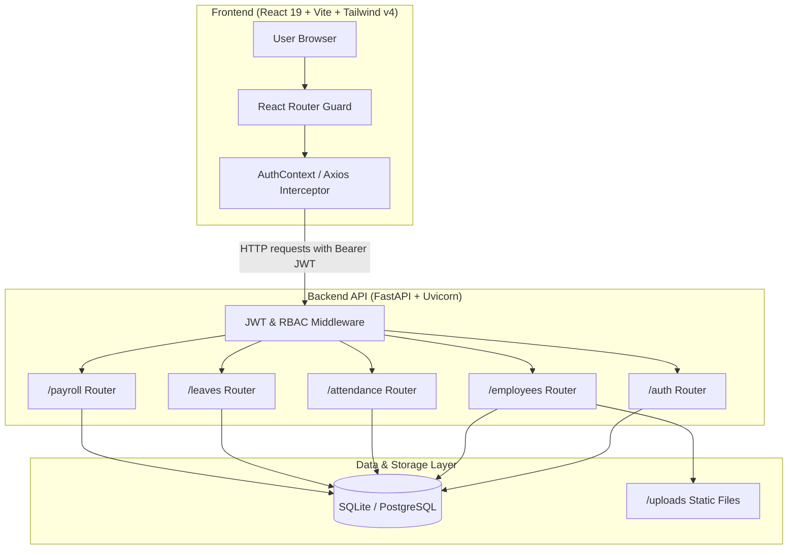
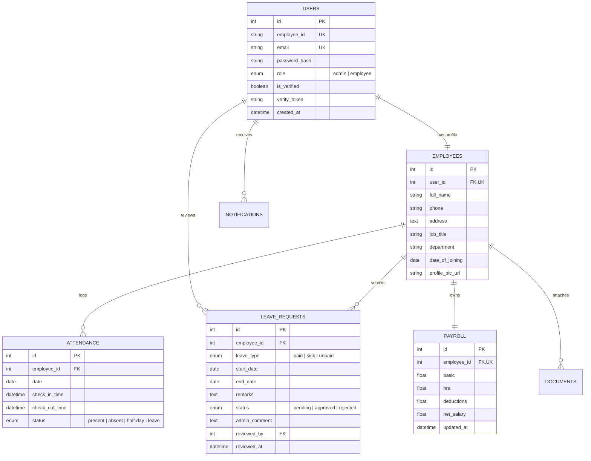

# Dayflow HRMS 

**Dayflow HRMS** is a modern, full-stack Human Resource Management System built for the **Odoo x NMIT Hackathon 2026**. 

It features a dual-portal architecture separating standard **Employee Self-Service** from **HR Administration**, providing end-to-end workflows for attendance tracking, leave requests with overlap detection, salary structure management, and secure role-based access control.

---

## Complete Tech Stack Breakdown

### Frontend Architecture
| Layer / Component | Technology | Version | Purpose |
| :--- | :--- | :--- | :--- |
| **UI Framework** | React | `^19.2.8` | Declarative component-driven UI architecture |
| **Build Tooling & Bundler** | Vite | `^8.2.0` | Ultra-fast ESM dev server & optimized production bundler |
| **Styling & CSS** | Tailwind CSS v4 | `^4.3.3` | Utility-first styling with `@tailwindcss/vite` integration |
| **Routing & Navigation** | React Router DOM | `^7.18.2` | Client-side routing, nested layouts, & protected route guards |
| **API Client** | Axios | `^1.19.0` | Promises-based HTTP client with request/response interceptors |
| **Iconography** | Lucide React | `^1.33.0` | Crisp, accessible UI icons |
| **Notifications & Toasts** | React Hot Toast | `^2.6.0` | Lightweight toast notifications |
| **Date Processing** | date-fns | `^4.4.0` | Date manipulation and formatting utilities |
| **Code Quality & Linter** | Oxlint | `^1.75.0` | Fast Rust-based JavaScript/JSX linter |

### Backend Architecture
| Layer / Component | Technology | Version | Purpose |
| :--- | :--- | :--- | :--- |
| **Language & Runtime** | Python | `3.10+` | Backend execution environment |
| **API Framework** | FastAPI | `0.115.0` | High-performance asynchronous REST API framework |
| **ASGI Server** | Uvicorn | `0.30.6` | Asynchronous server implementation for FastAPI |
| **ORM Framework** | SQLAlchemy | `2.0.43` | Object-Relational Mapping & database interaction |
| **Database Engine** | SQLite / PostgreSQL | `3.x` | Relational storage (SQLite for local demo; Postgres-ready ORM) |
| **Migration Control** | Alembic | `1.13.3` | Database schema migrations and version control |
| **Data Validation** | Pydantic v2 | `2.9.2` | Data parsing, validation, and schema enforcement |
| **App Configuration** | Pydantic-Settings | `2.11.0` | Type-safe environment variable management |
| **Authentication & Tokens** | PyJWT (`python-jose`) | `3.5.0` | JSON Web Token (JWT) encoding and verification |
| **Password Hashing** | Passlib & `bcrypt` | `4.0.1` | Secure password hashing (`bcrypt` algorithm) |
| **Static & File Uploads** | `python-multipart` & `aiofiles` | `23.2.1` | Async multipart form data handling & file serving |

---

## Security & Authorization Design

| Security Principle | Implementation Detail |
| :--- | :--- |
| **JWT Authentication** | Stateless Bearer token auth containing user ID (`sub`) and role claims (`admin` vs `employee`). |
| **Server-Side Data Isolation** | FastAPI dependency `get_current_employee` guarantees users can **only query and modify their own records**. |
| **Role-Based Access Control (RBAC)** | `require_admin` dependency enforces HTTP 403 Forbidden on all administrative endpoints. |
| **Password Hashing** | Passwords are NEVER stored in plain text; hashed using `bcrypt`. |
| **Route Protection (Frontend)** | React Router guards (`ProtectedRoute`, `AdminRoute`, `EmployeeRoute`) prevent client-side path unauthorized navigation. |

---

## System Architecture & Workflow



---

## Database Entity Relationship Diagram



---

## Core Features

### Employee Self-Service Portal
1. **Interactive Dashboard**: Quick metrics overview, check-in/out actions, and attendance summaries.
2. **Attendance Tracker**: One-click check-in and check-out. Automatically calculates hours worked and assigns `present` ( 4 hrs) or `half-day` (< 4 hrs) status.
3. **Leave Management**: Submit leave requests with date pickers and leave type selection (Paid, Sick, Unpaid). Includes automatic backend overlap detection.
4. **Payroll Breakdown**: Read-only access to itemized salary structure (Basic, HRA, Deductions, and Net Salary).
5. **Profile Settings**: Edit personal contact information (Phone, Address) and view company assignment details.

### Admin HR Portal
1. **HR Operations Dashboard**: Company-wide workforce statistics, pending leave queue alerts, and operational metrics.
2. **Employee Directory**: Search and view all staff members; create or update employee roles, job titles, and departments.
3. **Attendance Oversight**: View company-wide attendance logs with date filtering and manual override capabilities for correcting missed punches.
4. **Leave Approval Queue**: Review pending leave applications with single-click Approval or Rejection and mandatory/optional HR comments.
5. **Payroll Management Engine**: Configure and update compensation components for any employee with dynamic auto-calculation of Net Salary.

---

## API Endpoint Reference

### Authentication (`/auth`)
- `POST /auth/register`  Register a new user account & generate verification token.
- `POST /auth/login`  Authenticate credentials & receive JWT Bearer token.
- `GET /auth/verify/{token}`  Validate email verification token.
- `GET /auth/me`  Fetch current user identity details.

### Employee Management (`/employees`)
- `GET /employees/me`  Fetch profile of the authenticated employee.
- `PUT /employees/me`  Update contact details (phone, address) of current employee.
- `GET /employees`  *(Admin Only)* List all registered employees.
- `GET /employees/{id}`  *(Admin Only)* Fetch detailed profile of a specific employee.
- `PUT /employees/{id}`  *(Admin Only)* Update employee role, department, job title, or profile details.

### Attendance (`/attendance`)
- `POST /attendance/check-in`  Record daily check-in timestamp.
- `POST /attendance/check-out`  Record daily check-out timestamp & compute work status.
- `GET /attendance/me`  Fetch complete attendance history for current employee.
- `GET /attendance`  *(Admin Only)* List attendance records across company (supports filtering).
- `PUT /attendance/{record_id}`  *(Admin Only)* Override attendance timestamps or status.

### Leave Requests (`/leaves`)
- `POST /leaves`  Apply for leave (validates against date overlaps).
- `GET /leaves/me`  Fetch current employee's leave history and request status.
- `GET /leaves`  *(Admin Only)* Fetch all leave requests in the system.
- `PUT /leaves/{id}/approve`  *(Admin Only)* Approve a pending leave request.
- `PUT /leaves/{id}/reject`  *(Admin Only)* Reject a pending leave request.

### Payroll (`/payroll`)
- `GET /payroll/me`  Fetch current employee's breakdown of Basic, HRA, Deductions, and Net Salary.
- `GET /payroll`  *(Admin Only)* View payroll records for all employees.
- `PUT /payroll/{employee_id}`  *(Admin Only)* Configure salary components (Net Salary auto-calculated).

---

## How to Run Locally

### Prerequisites
- **Python**: Version `3.10` or higher
- **Node.js**: Version `18.x` or higher
- **npm**: Version `9.x` or higher
- **PostgreSQL**: Ensure PostgreSQL is installed and running locally. Create a database named `dayflow_db`. Alternatively, update the `DATABASE_URL` in `backend/.env` to point to your existing PostgreSQL database.


---

### 1 Start the Backend API

```bash
# Navigate to backend directory
cd backend

# Create virtual environment (recommended)
python -m venv venv

# Activate virtual environment
# Windows (PowerShell):
.\venv\Scripts\Activate.ps1
# Linux / macOS:
source venv/bin/activate

# Install dependencies
pip install -r requirements.txt

# Start the FastAPI server (Runs on port 8000)
python -m uvicorn app.main:app --port 8000 --host 0.0.0.0 --reload
```

*Note: Upon startup, the backend automatically initializes the database schema and seeds initial demo data.*

---

### 2 Start the Frontend Web App

```bash
# Open a new terminal window and navigate to frontend directory
cd frontend

# Install Node dependencies
npm install

# Start Vite development server (Runs on port 5173)
npm run dev
```

---

### 3 Access Points & Documentation

- **Web Application Interface**: [http://localhost:5173](http://localhost:5173)
- **Interactive API Documentation (Swagger)**: [http://localhost:8000/docs](http://localhost:8000/docs)
- **Alternative API Specification (ReDoc)**: [http://localhost:8000/redoc](http://localhost:8000/redoc)

---

## Pre-Configured Demo Credentials

| Role | Email | Password | Access Rights |
| :--- | :--- | :--- | :--- |
| **Admin (HR)** | `admin@dayflow.io` | `Admin@123` | Full HR Oversight, Approvals, Employee Management, Payroll |
| **Employee 1** | `alice@dayflow.io` | `Alice@123` | Self-Service Portal (Verified Email, Active Attendance History) |
| **Employee 2** | `bob@dayflow.io` | `Bob@123` | Self-Service Portal (Unverified Email State Demo) |

---

## Developed by- Team Saridon


- Sibam Prasad Sahoo
- Suryansh Anand
- Pritam Piyush
- Varsha Sharma

